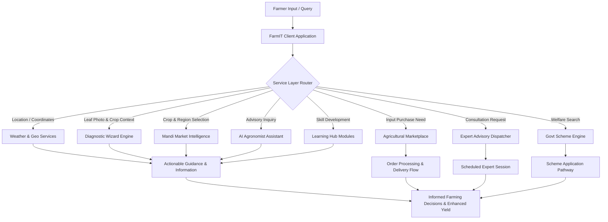
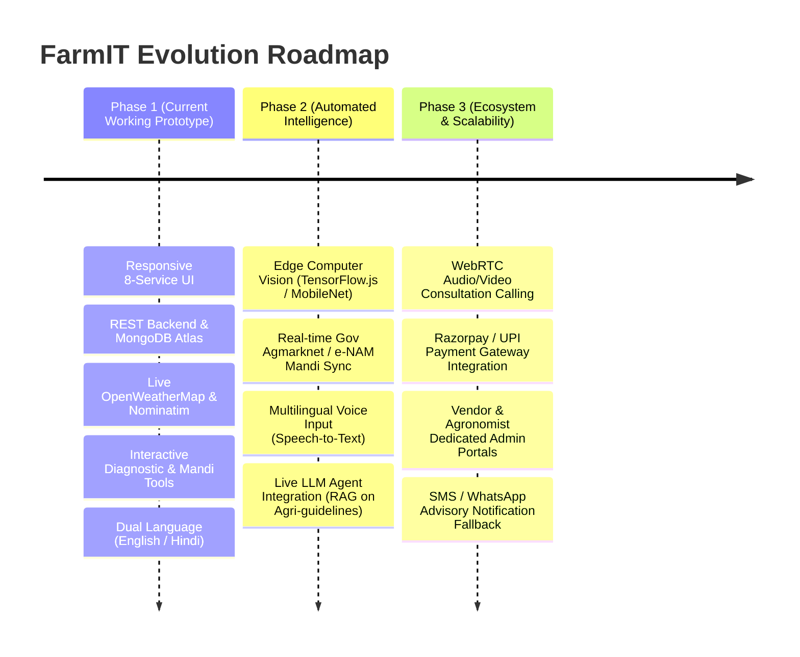

# FarmIT

<p align="center">
  
</p>

<p align="center">
  <strong>An integrated digital platform connecting farmers with agricultural information, guidance, and essential rural services.</strong>
</p>

<p align="center">
  <a href="https://github.com/Manjeet-cse/FarmIt"></a>
  <a href="https://farm-it-zeta.vercel.app/"></a>
  
  
  
  
  
</p>

---

## 1. Project Title

# FarmIT

**Tagline:** An integrated digital platform connecting farmers with agricultural information, guidance, and essential rural services.

FarmIT is an agritech platform designed for Indian farmers. It aggregates eight essential agricultural services—weather advisories, crop disease diagnosis, commodity market prices, direct agri-inputs marketplace, practical learning modules, verified expert consultations, an AI agronomy assistant, and government welfare scheme navigation—into a single, mobile-first, bilingual Progressive Web Application (PWA).

---

## 2. Problem Statement

Smallholder and marginal farmers in India encounter critical operational bottlenecks that negatively impact yield, increase input costs, and lower income realization:

1. **Fragmented Information Ecosystems**: Agricultural advisories, weather updates, and market intelligence are scattered across isolated government portals, regional news outlets, and messaging groups without unified context.
2. **Delayed Crop Disease Diagnosis**: Crop pests and fungal infections (such as powdery mildew or rust) often go undetected until significant damage occurs. Farmers frequently lack immediate access to scientific diagnosis, resulting in inappropriate or excessive chemical pesticide use.
3. **Information Asymmetry in Mandi Prices**: Daily wholesale commodity pricing varies significantly across neighboring Agricultural Produce Market Committees (APMCs). Without transparent, timely price tracking, farmers lack leverage when negotiating with intermediaries.
4. **Opaque Access to Government Schemes**: Subsidies, credit facilities (e.g., Kisan Credit Card), and insurance programs (e.g., PM Fasal Bima Yojana) exist, but complex eligibility criteria, undocumented procedures, and missed deadlines prevent eligible farmers from claiming financial entitlements.
5. **Restricted Access to Agronomy Specialists**: Reaching certified agronomists or plant pathologists traditionally requires travel to regional Krishi Vigyan Kendras (KVKs), leaving urgent field issues unresolved.
6. **Inefficient Farm Input Procurement**: Procuring authentic seeds, fertilizers, and equipment often involves long supply chains with inconsistent pricing and uncertain stock availability.

FarmIT addresses these challenges by consolidating timely, actionable, and localized advisory services into an accessible, low-friction interface.

---

## 3. Solution Overview

FarmIT eliminates fragmentation by serving as an end-to-end decision support and service delivery engine. The platform ingests farmer-specific context (crop portfolio, growth stage, soil type, geographic location) and maps it against eight integrated service modules to output clear agronomic guidance and transactional capabilities.

### Core User Flow

```
Farmer Need / Input (Crop Type, Symptoms, Location, Inquiry)
                           ↓
                        FarmIT
                           ↓
               8 Integrated Service Modules
                           ↓
              Relevant Guidance & Services
                           ↓
               Informed Farming Decisions
```

### The Eight Targeted Services

1. **Weather**: Hyperlocal real-time conditions, multi-day forecasts, and actionable agronomic impact warnings (e.g., spray windows, rain alerts).
2. **AI Diagnosis**: Context-driven crop disease assessment wizard with symptom surveys, severity grading, and dual organic/chemical remedy recommendations.
3. **Mandi Prices**: APMC market price board with 7-day trend analysis, daily percentage deltas, and commodity categorization (Rabi, Kharif, Cash Crops, Produce).
4. **Marketplace**: End-to-end agricultural input store offering certified seeds, fertilizers, crop protection chemicals, and farm machinery with cart and checkout workflows.
5. **Learning Hub**: Structured multimedia repository containing practical crop management tutorials, modern irrigation techniques, and soil conservation practices.
6. **Experts**: Direct directory and scheduling platform to connect farmers with verified agronomy specialists for audio, video, or chat consultations.
7. **AI Assistant**: A conversational digital agronomist providing instant advisory on day-to-day farming challenges and crop management questions.
8. **Govt Schemes**: Comprehensive catalog of central and state welfare initiatives with category filters, eligibility checks, and step-by-step application guidance.

---

## 4. Key Features

The following matrix outlines each feature, its functional scope, and its implementation status within this repository:

| Feature | Description | Status |
|---|---|---|
| **Weather** | Real-time weather data powered by OpenWeatherMap API with OSM Nominatim geocoding. Displays temperature, humidity, wind speed, UV index, hourly & 5-day forecasts, and automated crop impact alerts (e.g., fungal infection risk, spray timing). Includes backend fallback mock API. | **Implemented** |
| **AI Diagnosis** | Guided diagnostic workflow (`CropContextWizard`). Farmers upload or photograph affected crops, answer structured context questions (sowing duration, affected plant part, symptom history), and receive diagnostic output with severity metrics, organic remedies, chemical dosages, and direct product checkout links. | **Prototype** *(Simulated context inference engine)* |
| **Mandi Prices** | Market price board tracking 20+ commodities (Wheat, Mustard, Basmati Rice, Onion, Tomato, Cotton, etc.). Features 7-day historical trend curves, price ranges (low/medium/premium), percentage changes, and APMC market switcher. | **Prototype** *(Simulated APMC trend dataset)* |
| **Marketplace** | E-commerce catalogue spanning Seeds, Fertilizers, Pesticides, Machinery, and Tools. Includes category filtering, verified supplier badges, cart state management (`CartContext`), shipping address entry, payment selection (COD/UPI/Card), and order tracking (`OrdersScreen`). | **Implemented** *(Full e-commerce flow + MongoDB Order API)* |
| **Learning Hub** | Categorized educational library for farmers covering soil testing, drip irrigation, machinery operation, and crop protection. Supports difficulty tagging, duration metadata, and saved article/video bookmarks. | **Prototype** *(Curated UI media catalog)* |
| **Experts** | Directory of verified agronomists, plant pathologists, and soil scientists. Includes appointment scheduling across 3 consultation modes (Audio, Video, Chat), date/time slot selection, note capture, interactive chat simulator, and backend booking persistence. | **Implemented** *(Backend Models/Routes + Frontend Booking & Chat)* |
| **AI Assistant** | Interactive conversational interface ("FarmIt AI") acting as a digital agronomist. Delivers rapid answers to farming queries, crop disease inquiries, and local market rate questions with visual cards. | **Prototype** *(Bilingual UI simulator, ready for LLM API)* |
| **Govt Schemes** | Directory of 16+ government agricultural subsidy and support schemes (PM-KISAN, PM Fasal Bima, Soil Health Card, AIF, PMKSY, e-NAM, SMAM, Drone Didi, KCC). Provides category filters, eligibility criteria, subsidy amounts, deadlines, and application walkthrough modals. | **Implemented** |
| **Authentication & Profile** | JWT-based auth with password encryption (`bcryptjs`), Google Sign-In integration (`@react-oauth/google`), role-based routing (farmer, expert, vendor), and farm profile tracking (land area, irrigation, soil type). Includes rapid developer bypass option. | **Implemented** |
| **Localization (i18n)** | Full dual-language support for English and Hindi (`hi`), powered by `react-i18next` with real-time in-app switching and persistent preference storage. | **Implemented** |
| **Progressive Web App (PWA)** | Offline caching capability via Service Worker (`sw.js`) and mobile installability via Web App Manifest (`manifest.json`). | **Implemented** |

---

## 5. Technical Approach

FarmIT uses a decoupled client-server architecture built for low network latency, modular service scalability, and ease of deployment.

### Application Workflow



### Architectural Separation
- **Presentation Layer (Frontend)**: React 18 single-page application built on Vite, styled with Tailwind CSS, utilizing React Context for global state (Auth, Cart), and internationalized via `i18next`. Designed to be responsive across mobile handsets (bottom tabs, app bar) and desktop screens (top navigation, multi-column dashboard grid).
- **Service & Business Logic Layer**: Handles API abstraction, Axios interceptors with automated Bearer token attachment, geolocation query debouncing against Nominatim, and fallback state handling for offline readiness.
- **Persistence & API Layer (Backend)**: Node.js and Express RESTful API server connected to MongoDB via Mongoose. Manages user authentication, farmer crop records, marketplace inventories, e-commerce orders, expert appointments, and community threads.

---

## 6. System Architecture

The following diagram illustrates the active technical architecture, data flows, and external integrations in the repository:

```mermaid
graph TB
    subgraph Client ["Frontend Client (React 18 + Vite + PWA)"]
        UI["UI Components & Responsive Shell<br/>(Tailwind CSS, Material Symbols, Lucide)"]
        I18N["i18n Localization Engine<br/>(en.json / hi.json)"]
        SW["Service Worker (sw.js)<br/>& Manifest (PWA Cache)"]
        
        subgraph StateManagement ["Client State Management"]
            AuthCtx["AuthContext (JWT, User Profile, Dev Bypass)"]
            CartCtx["CartContext (Cart Items, Totals, Persistence)"]
        end

        subgraph ServiceClients ["Frontend Services"]
            APIService["Axios Client (api.js)<br/>Token Interceptors"]
            CropService["Crop Service (cropService.js)"]
            LocationService["Location Service (locationService.js)"]
            AuthService["Auth Service (authService.js)"]
        end
    end

    subgraph ExternalAPIs ["External Cloud Services"]
        OWM["OpenWeatherMap API<br/>(Weather & 5-Day Forecast)"]
        OSM["OpenStreetMap Nominatim<br/>(Forward / Reverse Geocoding)"]
        FirebaseSDK["Firebase SDK<br/>(Analytics: farmit-ef43b)"]
        GoogleOAuthAPI["Google OAuth 2.0<br/>(Google Sign-In)"]
    end

    subgraph Server ["Backend Server (Node.js + Express 5)"]
        ServerEntry["server.js (CORS, Express JSON, ErrorHandler)"]
        AuthMW["Auth Middleware<br/>(protect, authorize, JWT verify)"]

        subgraph Controllers ["API Controllers & Routers"]
            AuthCtrl["authController (/api/auth)"]
            CropCtrl["cropController (/api/crops)"]
            ProductCtrl["productController (/api/products)"]
            OrderCtrl["orderController (/api/orders)"]
            ExpertCtrl["expertController (/api/experts, /api/bookings)"]
            CommCtrl["communityController (/api/community)"]
            WeatherMock["Weather Mock Route (/api/weather)"]
        end
    end

    subgraph Database ["Data Tier (MongoDB Atlas)"]
        UserCol[("Users Collection<br/>(Farmers, Experts, Vendors)")]
        CropCol[("Crops Collection<br/>(Acreage, Growth Stage, Risk)")]
        ProductCol[("Products Collection<br/>(Seeds, Fertilizers, Tools)")]
        OrderCol[("Orders Collection<br/>(Items, Tracking, Payment)")]
        BookingCol[("ExpertBookings Collection<br/>(Date, Time, Type, Status)")]
        PostCol[("CommunityPosts Collection<br/>(Posts, Likes, Comments)")]
    end

    %% Client internal connections
    UI --> AuthCtx
    UI --> CartCtx
    UI --> ServiceClients
    UI --> I18N
    SW -.-> UI

    %% Client to External
    UI -->|Direct Fetch| OWM
    LocationService -->|Forward/Reverse Geocode| OSM
    UI -->|Client Analytics| FirebaseSDK
    AuthService -->|ID Token Request| GoogleOAuthAPI

    %% Client to Backend
    APIService -->|HTTP REST / Bearer Token| ServerEntry
    CropService --> APIService
    AuthService --> APIService

    %% Backend Routing
    ServerEntry --> AuthCtrl
    ServerEntry --> CropCtrl
    ServerEntry --> ProductCtrl
    ServerEntry --> OrderCtrl
    ServerEntry --> ExpertCtrl
    ServerEntry --> CommCtrl
    ServerEntry --> WeatherMock

    AuthCtrl --> AuthMW
    CropCtrl --> AuthMW
    ProductCtrl --> AuthMW
    OrderCtrl --> AuthMW
    ExpertCtrl --> AuthMW
    CommCtrl --> AuthMW

    %% Backend to Database
    AuthCtrl --> UserCol
    CropCtrl --> CropCol
    ProductCtrl --> ProductCol
    OrderCtrl --> OrderCol
    ExpertCtrl --> BookingCol
    CommCtrl --> PostCol
```



---

## 7. Technology Stack

This technology stack represents the libraries and services present in the repository configuration files (`package.json`, `.env`, source imports):

| Layer | Technology | Version | Purpose |
|---|---|---|---|
| **Frontend Framework** | React | `^18.2.0` | Declarative component UI library |
| **Frontend Build Tool** | Vite | `^5.1.4` | Modern development server and production bundler |
| **Frontend Routing** | React Router DOM | `^6.22.3` | Client-side routing and protected view guards |
| **Styling & Design** | Tailwind CSS | `^3.4.19` | Utility-first responsive styling and typography |
| **PostCSS Pipeline** | Autoprefixer / PostCSS | `^10.5.0` / `^8.5.13` | Vendor prefixing and CSS transformation |
| **HTTP Client** | Axios | `^1.16.0` | Promise-based HTTP client with request/response interceptors |
| **Internationalization** | i18next & react-i18next | `^26.0.10` / `^17.0.7` | Framework for multilingual support (English & Hindi) |
| **Language Detection** | i18next-browser-languagedetector | `^8.2.1` | Automatic browser language detection and persistence |
| **Icons & Typography** | Lucide React | `^0.344.0` | Modern SVG iconography |
| **Icons (Material)** | Google Material Symbols | Web Font | Variable icon font used across navigation and cards |
| **Typography (Fonts)** | Plus Jakarta Sans & Be Vietnam Pro | Google Fonts | Primary headline and body typography |
| **Third-Party Auth** | `@react-oauth/google` | `^0.13.5` | Client-side Google Identity Services Sign-In |
| **Cloud Analytics** | Firebase SDK | `^12.13.0` | App initialization and web analytics tracking |
| **Backend Runtime** | Node.js | `>= 18.x` | Server-side JavaScript execution environment |
| **Backend Framework** | Express | `^5.2.1` | REST API routing and middleware framework |
| **Database & ODM** | MongoDB / Mongoose | `^9.6.1` | Schema modeling and database interaction |
| **Authentication & Tokens** | JSON Web Tokens (`jsonwebtoken`) | `^9.0.3` | Stateless Bearer token generation and verification |
| **Password Hashing** | bcryptjs | `^3.0.3` | Salted password encryption |
| **Google Auth Verification** | `google-auth-library` | `^10.6.2` | Verification of Google ID tokens on backend |
| **CORS Middleware** | cors | `^2.8.6` | Cross-Origin Resource Sharing handling |
| **Environment Config** | dotenv | `^17.4.2` | Environment variable management |
| **Dev Process Manager** | Nodemon | `^3.1.14` | Hot-reloading development server for Node.js |
| **External Weather API** | OpenWeatherMap REST API | API 2.5 | Real-time weather and 5-day / 3-hour forecasts |
| **External Geocoding** | OpenStreetMap Nominatim | REST | Forward geocoding and reverse lat/long translation |

---

## 8. Repository Structure

```text
FarmIt/
├── backend/                             # Express REST API & Database Models
│   ├── config/
│   │   └── db.js                        # Mongoose database connection setup
│   ├── controllers/
│   │   ├── authController.js            # User signup, login, Google auth, profile
│   │   ├── communityController.js       # Community forum posts, comments, likes
│   │   ├── cropController.js            # Farmer crop lifecycle CRUD
│   │   ├── expertController.js          # Agronomist listing & consultation booking
│   │   ├── orderController.js           # E-commerce checkout & order status
│   │   └── productController.js         # Agri-input marketplace listings & filters
│   ├── middleware/
│   │   ├── asyncHandler.js              # Express async route wrapper
│   │   ├── auth.js                      # JWT verification & role authorization
│   │   └── errorHandler.js              # Centralized JSON error response handler
│   ├── models/
│   │   ├── CommunityPost.js             # Mongoose schema for farmer discussions
│   │   ├── Crop.js                      # Schema for farmer crops, stages & acreage
│   │   ├── ExpertBooking.js             # Schema for expert appointment bookings
│   │   ├── Order.js                     # Schema for orders, items & delivery
│   │   ├── Product.js                   # Schema for marketplace catalog items
│   │   └── User.js                      # Schema for users, passwords, roles, farm data
│   ├── routes/
│   │   ├── authRoutes.js                # /api/auth routes
│   │   ├── communityRoutes.js           # /api/community routes
│   │   ├── cropRoutes.js                # /api/crops routes
│   │   ├── expertRoutes.js              # /api/experts & /api/bookings routes
│   │   ├── orderRoutes.js               # /api/orders routes
│   │   └── productRoutes.js             # /api/products routes
│   ├── utils/
│   │   ├── generateToken.js             # JWT signing utility
│   │   └── seedData.js                  # Database seed script for prototype data
│   ├── .env                             # Backend environment variables
│   ├── package.json                     # Backend dependencies and scripts
│   └── server.js                        # Express app entry point & route definitions
│
├── frontend/                            # React 18 Single-Page Application (Vite)
│   ├── assets/                          # Official high-resolution brand assets & logos
│   ├── public/
│   │   ├── icons/                       # PWA application launcher icons
│   │   ├── images/                      # Static demo imagery & crop assets
│   │   ├── manifest.json                # Web App Manifest for mobile installation
│   │   └── sw.js                        # Progressive Web App Service Worker
│   ├── src/
│   │   ├── assets/                      # Bundled images, crop visuals, and brand logos
│   │   ├── components/
│   │   │   ├── ai/                      # Floating AI button & quick access trigger
│   │   │   ├── common/                  # AppTopBar, DashboardGridCard, ProtectedRoute
│   │   │   ├── diagnosis/               # CropContextWizard (Step-by-step diagnostic)
│   │   │   └── layout/                  # BottomTabs, TopNavbar, DesktopSidebar, Shell
│   │   ├── hooks/
│   │   │   └── useMediaQuery.js         # Responsive breakpoint hooks (mobile/desktop)
│   │   ├── i18n/
│   │   │   ├── locales/
│   │   │   │   ├── en.json              # English UI string translations
│   │   │   │   └── hi.json              # Hindi UI string translations
│   │   │   └── index.js                 # i18next configuration & initialization
│   │   ├── navigation/
│   │   │   ├── AppNavigator.jsx         # Root router & role-based route switches
│   │   │   ├── AuthNavigator.jsx        # Login, signup, onboarding, splash screens
│   │   │   ├── ExpertTabs.jsx           # Scaffolded expert portal navigation
│   │   │   ├── FarmerTabs.jsx           # Main farmer workspace routes
│   │   │   └── VendorTabs.jsx           # Scaffolded vendor portal navigation
│   │   ├── screens/
│   │   │   ├── auth/                    # Login, Signup (Step 1 & 2), Language, Onboarding
│   │   │   └── farmer/                  # 8 Core Service Screens & E-Commerce Flow
│   │   │       ├── AIAssistantScreen.jsx    # FarmIt AI Agronomist Chat
│   │   │       ├── CartScreen.jsx           # Input Shopping Cart
│   │   │       ├── CheckoutScreen.jsx       # Delivery & Payment selection
│   │   │       ├── DiagnosisScreen.jsx      # Plant Disease Diagnosis Wizard
│   │   │       ├── EditProfileScreen.jsx    # Farm land area, soil, irrigation edit
│   │   │       ├── ExpertBookingScreen.jsx  # Slot picker & booking confirmation
│   │   │       ├── ExpertChatScreen.jsx     # Live agronomist chat simulator
│   │   │       ├── ExpertsScreen.jsx        # Agronomist listing & specializations
│   │   │       ├── HomeScreen.jsx           # Integrated Farmer Overview Dashboard
│   │   │       ├── LearningScreen.jsx       # Agricultural tutorials & video guides
│   │   │       ├── MandiScreen.jsx          # Commodity prices & 7-day trend analysis
│   │   │       ├── MarketplaceScreen.jsx    # Agri-inputs catalog & search
│   │   │       ├── OrdersScreen.jsx         # Active order tracking & past invoices
│   │   │       ├── ProfileScreen.jsx        # Farmer details, farm profile, settings
│   │   │       ├── SubsidyScreen.jsx        # Government scheme guides & applications
│   │   │       └── WeatherScreen.jsx        # Live weather forecast & crop impacts
│   │   ├── services/
│   │   │   ├── api.js                   # Axios client instance & interceptors
│   │   │   ├── authService.js           # Authentication API calls & token storage
│   │   │   ├── cropService.js           # Crop management API calls with fallbacks
│   │   │   └── locationService.js       # Nominatim geocoding & debounced search
│   │   ├── store/
│   │   │   ├── AuthContext.jsx          # User authentication state & session bypass
│   │   │   └── CartContext.jsx          # Shopping cart state & quantity modifiers
│   │   ├── styles/
│   │   │   └── global.css               # Color variables, utility styles, animations
│   │   ├── utils/
│   │   │   └── indianCities.js          # Default Indian city datasets for quick select
│   │   ├── App.jsx                      # App root with Context Providers
│   │   ├── firebase.js                  # Firebase app initialization & analytics
│   │   └── main.jsx                     # DOM mount point
│   ├── .env                             # Frontend environment variables
│   ├── index.html                       # HTML5 entry template & PWA registration
│   ├── package.json                     # Frontend dependencies and build scripts
│   ├── tailwind.config.js               # Theme colors, container styles, font families
│   ├── vercel.json                      # Single-page app rewrite configuration
│   └── vite.config.js                   # Vite React plugin setup
│
├── .gitignore                           # Git ignore rules
└── README.md                            # Complete technical project documentation
```

---

## 9. API Reference

The backend Express application provides a modular RESTful API under the `/api` prefix:

### Authentication (`/api/auth`)
- `POST /api/auth/signup` — Register a new user (`name`, `email`, `phone`, `role`, `location`, `preferredLanguage`).
- `POST /api/auth/login` — Authenticate using phone number/email and password.
- `POST /api/auth/google` — Authenticate using Google OAuth 2.0 credential token.
- `GET /api/auth/me` — Fetch current authenticated user profile (`Bearer JWT` required).
- `PUT /api/auth/profile` — Update farm details (`totalLandArea`, `soilType`, `irrigationType`, `location`).
- `PUT /api/auth/reset-password` — Password reset by registered phone number.
- `POST /api/auth/check-user` — Verify if an identifier (phone/email) already exists.

### Crops (`/api/crops`)
- `GET /api/crops` — Retrieve all active crops belonging to the authenticated farmer.
- `POST /api/crops` — Register a crop (`cropName`, `variety`, `cropStage`, `acreage`, `healthStatus`).
- `GET /api/crops/:id` — Retrieve crop record by ID.
- `PUT /api/crops/:id` — Update growth stage, health status, or upcoming farm operations.
- `DELETE /api/crops/:id` — Remove a crop from the farmer's active monitoring list.

### Marketplace Products (`/api/products`)
- `GET /api/products` — Retrieve products with optional query parameters (`category`, `search`, `sort`, `page`, `limit`).
- `GET /api/products/:id` — Retrieve comprehensive product specifications and seller details.
- `POST /api/products` — Create a new product listing (`Bearer JWT` required).

### Orders (`/api/orders`)
- `GET /api/orders` — List authenticated user's order history and delivery statuses.
- `POST /api/orders` — Place an order (`items`, `totalAmount`, `deliveryAddress`, `paymentMethod`).
- `GET /api/orders/:id` — Fetch specific order breakdown and tracking milestone details.
- `PUT /api/orders/:id/status` — Update order delivery status (placed, confirmed, shipped, delivered, cancelled).

### Expert Consultations (`/api`)
- `GET /api/experts` — Public list of all registered agricultural specialists.
- `GET /api/bookings` — Fetch farmer's consultation appointments.
- `POST /api/bookings` — Schedule an expert appointment (`expertId`, `bookingType`, `bookingDate`, `bookingTime`, `topic`).
- `PUT /api/bookings/:id` — Modify or cancel a scheduled booking.

### Community Hub (`/api/community`)
- `GET /api/community/posts` — Retrieve community questions and agricultural tips.
- `POST /api/community/posts` — Publish a new farmer question or field observation.
- `PUT /api/community/posts/:id/like` — Toggle like on a community post.
- `POST /api/community/posts/:id/comment` — Submit a response or reply to a post.

### Weather Fallback (`/api/weather`)
- `GET /api/weather` — Returns mock weather conditions, forecast, and crop-specific risk advisories.

---

## 10. Data Models

The backend persists application records using Mongoose schemas:

1. **User (`User.js`)**: Name, unique email, unique 10-digit Indian phone number, encrypted password, role (`farmer`, `expert`, `vendor`, `admin`), preferred language, location, total land area (acres), irrigation type (drip, sprinkler, rainfed), and soil type (alluvial, black, clay, sandy).
2. **Crop (`Crop.js`)**: Crop name, variety, acreage, growth percentage (0–100%), stage (`Sowing`, `Growing`, `Flowering`, `Grain Filling`, `Harvesting`), health status (`Healthy`, `Needs Attention`, `Critical`), disease risk alerts, soil moisture, and farmer relation ID.
3. **Product (`Product.js`)**: Product name, category (`Seeds`, `Fertilizers`, `Pesticides`, `Tools`, `Organic`), price, original price, stock inventory, rating, review count, tags, seller ID, and text indexing for search.
4. **Order (`Order.js`)**: Auto-generated human-readable order ID (e.g., `OD784912045`), user reference, embedded product snapshots (quantity, price, title), delivery address, delivery fee, payment method (`upi`, `cod`, `card`), payment status, and order timeline status.
5. **ExpertBooking (`ExpertBooking.js`)**: Farmer ID, expert ID, booking type (`audio`, `video`, `chat`), booking date, time slot, duration (minutes), consultation topic, and status (`pending`, `confirmed`, `completed`, `cancelled`).
6. **CommunityPost (`CommunityPost.js`)**: Author reference, text content, image attachments, category (`Question`, `Tip`, `Discussion`, `Success Story`), array of user likes, and nested comments.

---

## 11. Getting Started & Local Setup

### Prerequisites
- **Node.js**: v18.0.0 or higher
- **npm**: v9.0.0 or higher
- **MongoDB**: A local MongoDB instance or a free [MongoDB Atlas](https://www.mongodb.com/atlas) cluster connection string.

### 1. Clone the Repository
```bash
git clone https://github.com/Manjeet-cse/FarmIt.git
cd Farmit
```

### 2. Backend Setup
1. Open a terminal in the `backend/` directory:
   ```bash
   cd backend
   npm install
   ```

2. Create a `.env` file in `backend/` (or verify existing `.env`):
   ```env
   PORT=5001
   MONGO_URI=mongodb+srv://<username>:<password>@cluster.mongodb.net/farmit?retryWrites=true&w=majority
   JWT_SECRET=your_secure_jwt_secret_key_here
   JWT_EXPIRE=30d
   GOOGLE_CLIENT_ID=your_google_client_id_here
   NODE_ENV=development
   ```

3. Seed Initial Demo Data:
   ```bash
   npm run seed
   ```
   *This populates sample users (farmer, expert, vendor), crops (Wheat, Mustard), and initial marketplace products.*

4. Start the backend development server:
   ```bash
   npm run dev
   ```
   *The API will start listening at `http://localhost:5001`.*

### 3. Frontend Setup
1. Open a second terminal in the `frontend/` directory:
   ```bash
   cd frontend
   npm install
   ```

2. Create or verify `.env` in `frontend/`:
   ```env
   VITE_API_URL=http://localhost:5001/api
   VITE_GOOGLE_CLIENT_ID=your_google_client_id_here
   ```

3. Launch the Vite development server:
   ```bash
   npm run dev
   ```
   *The application will open at `http://localhost:5173`.*

> **Quick Evaluation Note**: The prototype includes an automated developer session fallback in `AuthContext.jsx`. You can test all authenticated farmer screens directly without manual login friction.

---

## 12. Progressive Web App & Offline Capabilities

FarmIT is built as a Progressive Web App (PWA) to serve rural areas with intermittent cellular connectivity:

- **Service Worker (`sw.js`)**: Caches essential shell resources (HTML, CSS, JavaScript, application icons) to ensure instant loading on repeat visits.
- **Web App Manifest (`manifest.json`)**: Configured with agricultural branding, `#2E7D32` theme color, and standalone display mode for home screen installation on Android and iOS devices.
- **Adaptive Data Caching**: Frequently visited screens (such as active crop schedules, saved learning modules, and cart selections) utilize local browser storage to maintain state when the user is temporarily offline.

---

## 13. Future Roadmap

The FarmIT roadmap outlines key architectural enhancements moving from the current prototype to full production scale:



### Planned Technical Enhancements:
- **On-Device Vision Model**: Replacing the current contextual questionnaire prototype with an on-device TensorFlow.js / CoreML plant leaf classification model trained on the PlantVillage dataset.
- **National Mandi API Integration**: Transitioning simulated mandi price series to the official Government of India Open Data Portal (`data.gov.in` / Agmarknet) commodity price feed.
- **Voice-First Agronomy Interface**: Integrating speech recognition models to enable voice-based queries in regional dialects for semi-literate farmers.
- **Production Payment Gateway**: Connecting UPI and digital wallets via Razorpay or Cashfree for automated escrow transactions between farmers and verified vendors.

---

## 14. License & Author

- **Author**: Manjeet Lodha ([@Manjeet-cse](https://github.com/Manjeet-cse))
- **Repository**: [https://github.com/Manjeet-cse/FarmIt](https://github.com/Manjeet-cse/FarmIt)
- **License**: [ISC License](file:///Users/manjeet/Projects/Farmit/backend/package.json#L17)

---

<p align="center">
  <sub>Built with precision to empower Indian agriculture through accessible digital technology.</sub>
</p>
